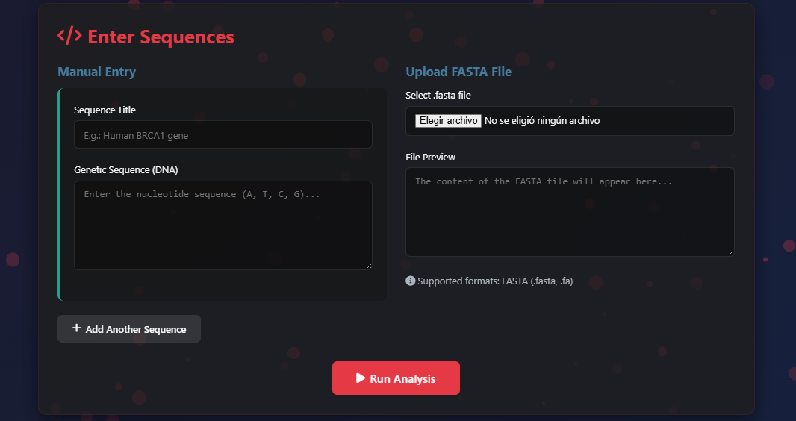
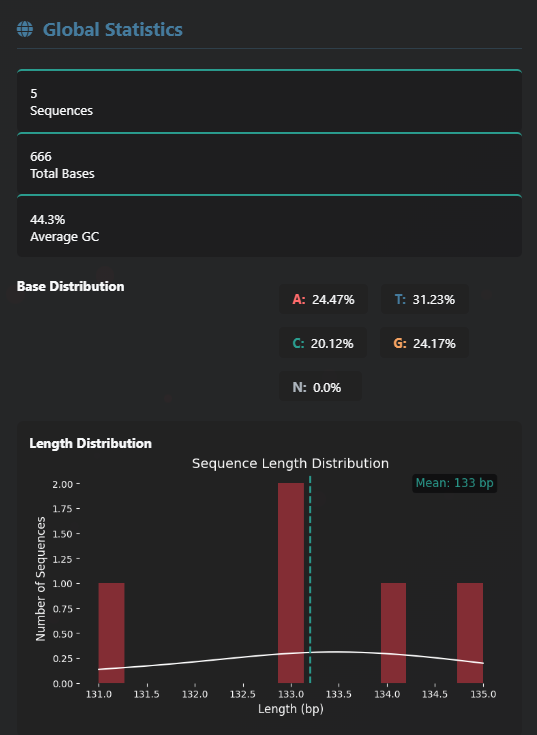
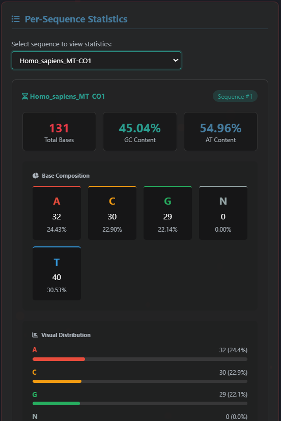
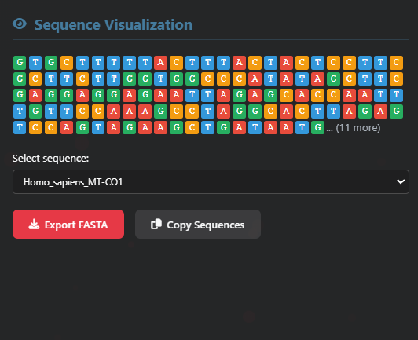
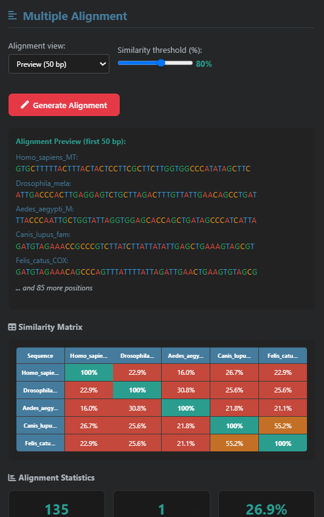
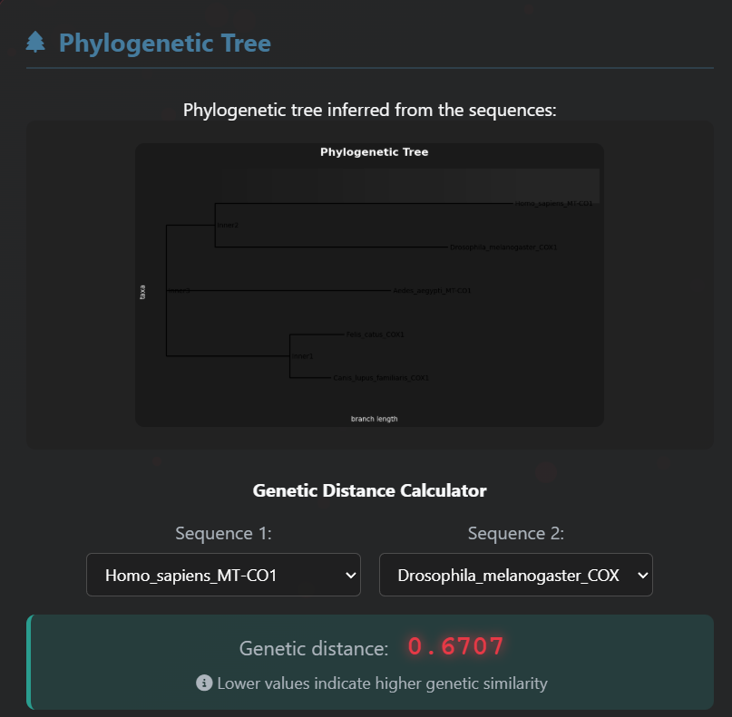
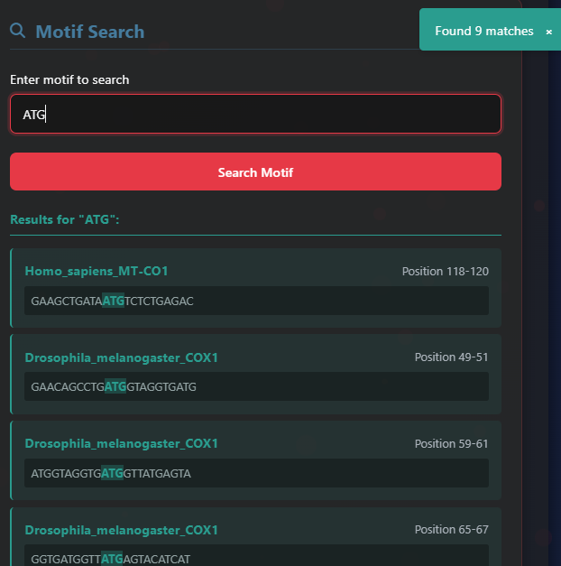

# GenomicsFreedom

GenomicsFreedom is an interactive web application built with **Flask** for exploring and visualizing genomic sequences. The project combines basic analyses (length, GC content, base distribution) with tools for multiple alignment, phylogenetic tree generation, and motif search, all within a modern interface.


---

## 🚀 Features

### 1. Flexible Sequence Input
- Manual entry of multiple sequences through dynamic forms.
- FASTA file upload with live preview in the browser.




### 2. Global Statistics
- Total number of sequences and bases.
- Average GC content and nucleotide distribution.
- Length histogram generated with Matplotlib/Seaborn.




### 3. Per‑Sequence Statistics
- Individual length, base composition, and GC/AT percentages.
- Interactive selector with comparative summary across sequences.



### 4. Sequence Visualization & Export
- Color‑coded rendering of nucleotide sequences.
- Export all sequences to FASTA or copy to clipboard with one click.



### 5. Multiple Alignment & Similarity Matrix
- Alignment preview/full view/consensus sequence.
- Dynamic similarity matrix and alignment metrics (length, conserved positions, similarity score, gaps).



### 6. Phylogenetic Tree & Distance Calculator
- MUSCLE integration for high‑quality alignments or fallback to a Hamming‑based tree.
- Interactive calculator for pairwise genetic distances.



### 7. Motif Search
- Search for custom motifs across all sequences with positional context.



---

## 🛠 Installation

1. **Clone the repository**
   ```bash
   git clone https://github.com/your_user/GenomicsFreedom.git
   cd GenomicsFreedom
   ```
2. **Create a virtual environment (optional but recommended)**
   ```bash
   python -m venv .venv
   source .venv/bin/activate  # On Windows: .venv\Scripts\activate
   ```
3. **Install dependencies**
   ```bash
   pip install -r requirements.txt
   ```  
4. **Verify MUSCLE**
* The app expects `muscle.exe` in `bin/`.
* On Linux/Mac, install MUSCLE and adjust `MUSCLE_PATH` in `app.py` if needed.
* If MUSCLE is unavailable, a simplified distance‑based tree is generated.

---

## ▶️ Usage

1. Launch the application:
  ```bash
  python app.py
  ```
2. Visit http://localhost:5000/ in your browser.
3. Enter sequences manually or upload a FASTA file.
4. Click “Run Analysis” to generate statistics and visualizations.
5. Explore the results dashboard: visualization, alignment, distance calculator, motif search, etc.

---

## 📂 Project Structure
```
GenomicsFreedom/
├── app.py               # Main Flask application
├── bin/
│   └── muscle.exe       # MUSCLE binary for multiple alignment
├── requirements.txt     # Python dependencies
├── seq_test/
│   └── seq.fasta        # Example sequences
├── static/
│   ├── css/
│   │   ├── styles.css   # Global styles
│   │   └── results.css  # Result‑specific styles
│   └── js/
│       ├── main.js      # Scripts for index page
│       └── results.js   # Scripts for results page
└── templates/
    ├── index.html       # Entry form
    └── results.html     # Results dashboard
```

---

## 📚 Technologies & Software References
- [Flask](https://flask.palletsprojects.com/)
- [Biopython](https://biopython.org/)
- [NumPy](https://numpy.org/)
- [Matplotlib](https://matplotlib.org/) & [Seaborn](https://seaborn.pydata.org/)
- HTML5, CSS3, JavaScript
- [MUSCLE](https://www.drive5.com/muscle/)

---

## 🤝 Contributing
Contributions are welcome! Open an issue or submit a pull request with your ideas for new features, performance improvements or bug fixes.

Enjoy exploring genomic sequences with GenomicsFreedom!

---

## 📬 Contact
Adrian Chalco Gonzalez
adrian.chalco@upch.pe

Benjamín Hurtado Berrocal
benjamin.hurtado@upch.pe
